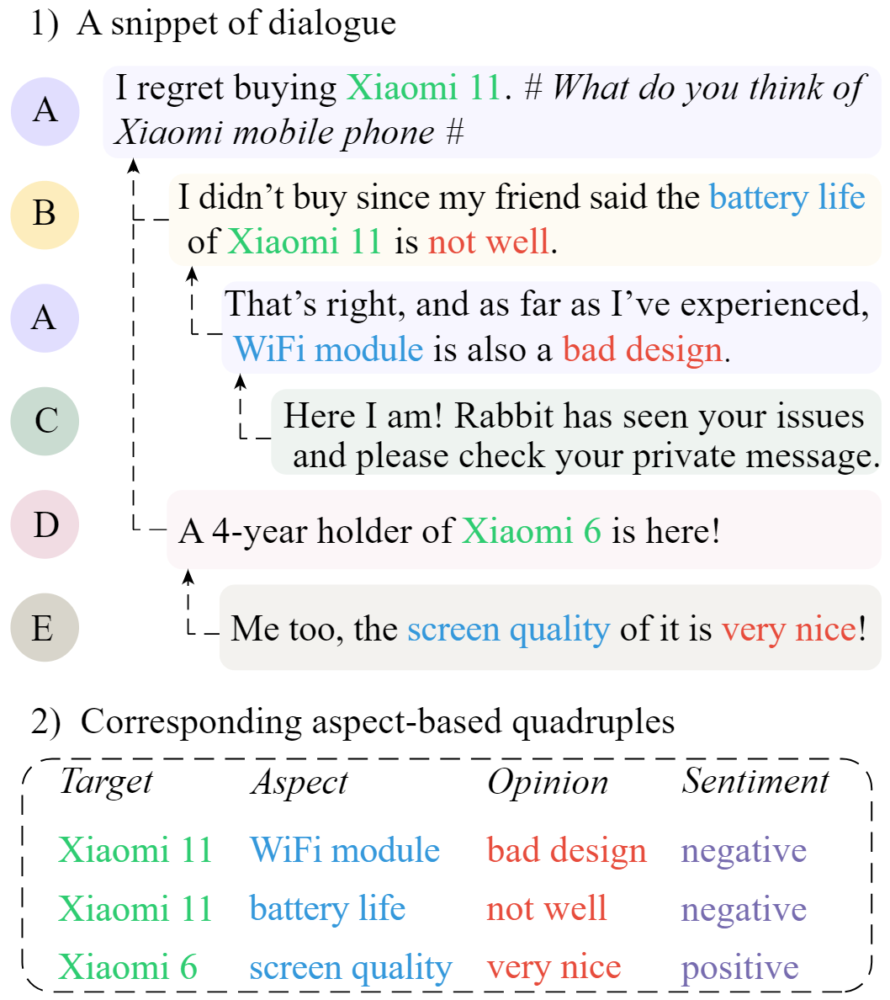

<!-- <p align="center"> -->
<!-- </p> -->
# DiaASQ
<a href="https://github.com/unikcc/DiaASQ">
  
</a>
<a href="https://github.com/unikcc/DiaASQ" rel="nofollow">
  
</a>
<a href="https://huggingface.co/docs/transformers/index" rel="nofollow">
  
</a>

This repository contains data and code for the ACL23 (findings) paper: [DiaASQ: A Benchmark of Conversational Aspect-based Sentiment Quadruple Analysis](https://arxiv.org/abs/2211.05705)


**See the [project page](https://diaasq-page.pages.dev/) for more details.**

------

To clone the repository, please run the following command:

```bash
git clone https://github.com/unikcc/DiaASQ
```

## News 🎉
<!-- :sparkles: `2023-05-10`: Released code and dataset.   -->
:loudspeaker: `2023-05-10`: Released code and dataset.  
:zap: `2022-12-10`: Created repository.  


## Quick Links
- [Overview](#overview)
- [Requirements](#requirements)
- [Code Usage](#code-usage)
- [Citation](#citation)


## Overview
In this work, we propose a new task named DiaASQ, which aims to extract Target-Aspect-Opinion-Sentiment quadruples from the given dialogue.
More details about the task can be found in our [paper](https://arxiv.org/abs/2211.05705).


<p align="center">

</p>


## DiaASQ Data

The dataset can be found at:
  ```bash
  data/dataset
    - jsons_en
    - jsons_zh
  ```


## Requirements

The model is implemented using PyTorch. The versions of the main packages:

+ python>=3.7
+ torch>=1.8.1

Install the other required packages:
``` bash
pip install -r requirements.txt
```

## Code Usage 

+ Train && Evaluate on the Chinese dataset
  ```bash 
  bash scripts/train_zh.sh
  ```

+ Train && Evaluate on the English dataset
  ```bash 
  bash scripts/train_en.sh
  ```

+ GPU memory requirements 

  | Dataset | Batch size | GPU Memory |
  | --- | --- | --- |
  | Chinese | 2 |  8GB. |
  | English | 2 | 16GB. |

+ Customized hyperparameters:  
You can set hyperparameters in `main.py` or `src/config.yaml`, and the former has a higher priority.


## Citation
If you use our dataset, please cite the following paper:
```
@inproceedings{li-2023-diaasq,
    title = "{D}ia{ASQ}: A Benchmark of Conversational Aspect-based Sentiment Quadruple Analysis",
    author = "Li, Bobo  and Fei, Hao and Li, Fei and Wu, Yuhan and Zhang, Jinsong and Wu, Shengqiong and Li, Jingye and
      Liu, Yijiang and Liao, Lizi and Chua, Tat-Seng and Ji, Donghong",
    booktitle = "Findings of ACL",
    year = "2023",
    pages = "13449--13467",
}
```
